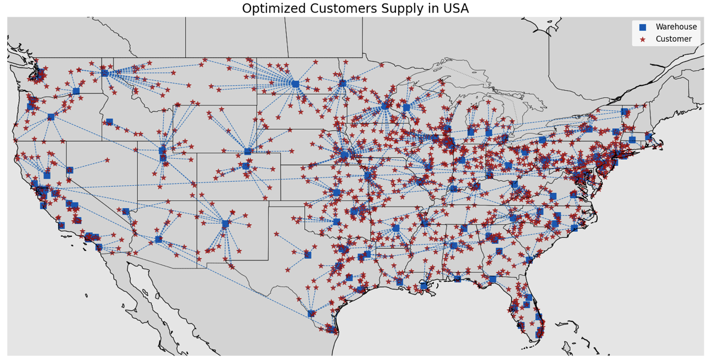

## Optimizing Warehousing: A Deep Dive into Facility Location Problems

### Introduction

Facility Location Problems (FLPs) are classical optimization tasks that aim to identify the most suitable sites for warehouses or factories to minimize operational costs. These tasks have significant applications in logistics, supply chain management, and urban planning. This blog explores the Capacitated Facility Location Problem (CFLP), its mathematical formulation, and a Python implementation using PuLP.

### The Foundation of FLPs

The core idea of FLPs is to minimize two primary cost components:
	1.	**Transportation Costs:**  The expenses incurred in delivering goods from warehouses to customers.
	2.	**Fixed Costs:** The location-specific operational costs, such as rent, taxes, and utilities.

This post will focus on the Capacitated Facility Location Problem (CFLP), where warehouses have limited storage or operational capacities.

### Mathematical Formulation

The objective of CFLP is to find the optimal number and location of warehouses to minimize the sum of transportation and fixed costs, while meeting customer demands.

Objective function:

$\sum^{M}_{j=1} {f_j \cdot y_j} + \sum^{N}_{i=1}\sum^{M}_{j=1}t_{ij} \cdot x_{ij}$

Where,

- $N$ is a set of customer locations.
- $M$ is a set of candidate warehouse locations.
- $f_j$ represent the annual fixed cost for warehouse $j$.
- $t_{ij}$ represents the cost of transportation from warehouse $j$ to customer $i$.
- $x_{ij}$ is the number of units delivered from warehouse $j$ to customer $i$.
- $y_j$ is a binary variable $y_j \in \{0,1\}$, indicating whether the warehouse should be built in the location $j$ $(y_j = 1)$ or not $(y_j = 0)$.

Constraints:
1.	Warehouse capacities must not be exceeded:

$\sum^{N}_{i=1} x_{ij} \leq C_{j} \cdot y_j$

2.	Customer demands must be met:

$0 \leq x_{ij} \leq d_i \cdot y_j$

3.	Deliveries are non-negative and respect demand limits:

$\sum^{M}_{j=1} x_{ij} = d_i$

4.	Warehouses are either built or not:

$ y_j \in \{0, 1\} $

Data used: https://simplemaps.com/data/us-cities

For more on the project checkout my medium blog

 

